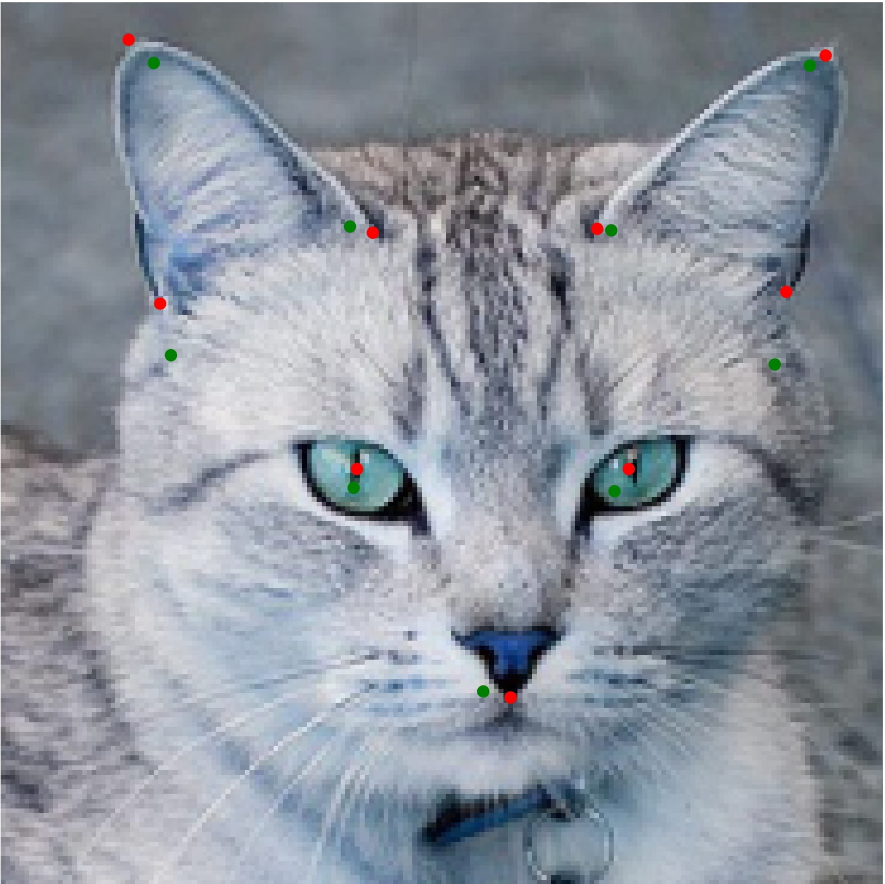
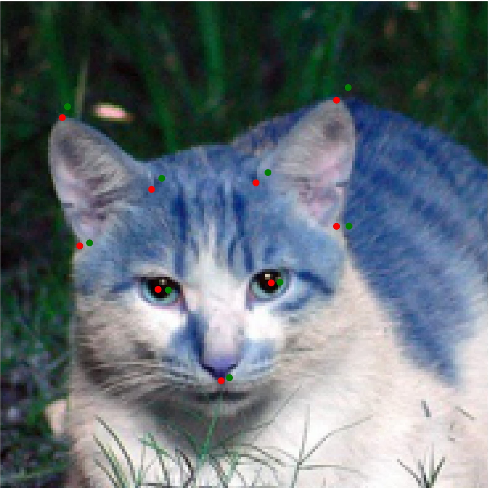
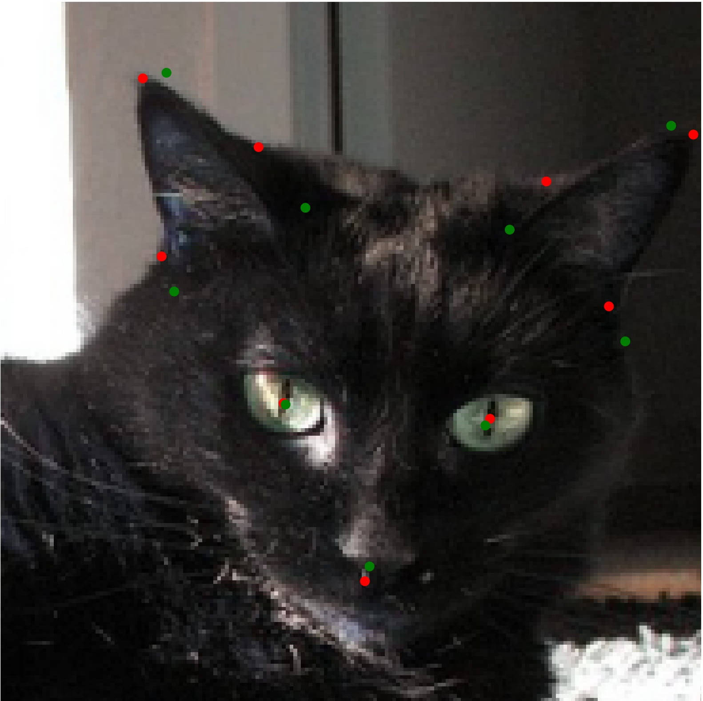

# Keypoint Detection for Cat Faces
This project contains data-cleaning, data augmentation and the training of a deep-learning model for keypoint regression for facial features on cat faces.

The model is a EfficientNetB0 Convolutional Neural Network and was trained for 50 epochs, training loss is RMSE and graphed below, Ideally this model would train for more than 100 epochs for more accurate keypoints.

***Batch number, vs RMSE Loss***

Keypoint regression examples are shown below, Red is shown as the ground truth and green as the predicted points.

