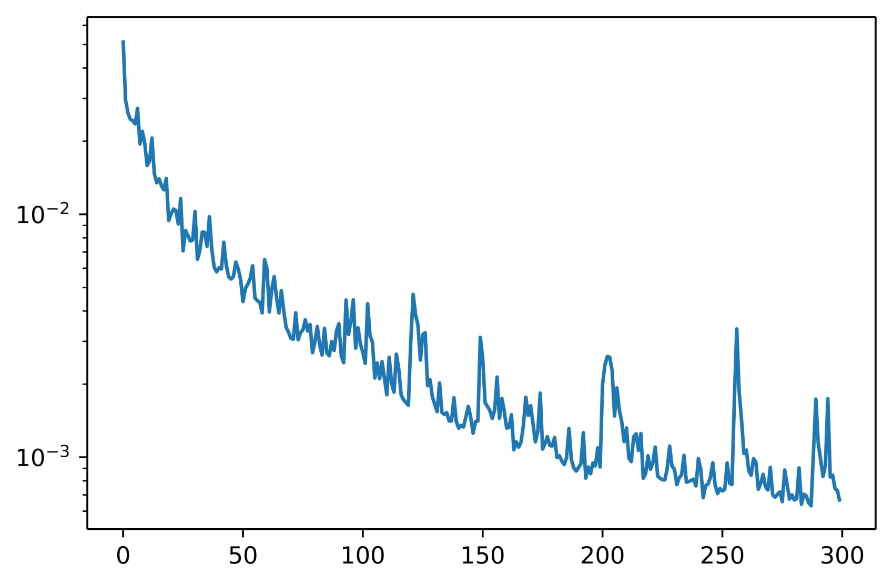

# Keypoint Detection for Cat Faces
This project contains data-cleaning, data augmentation and the training of a deep-learning model for keypoint regression for facial features on cat faces.

The model is a EfficientNetB0 Convolutional Neural Network and was trained for 50 epochs, training loss is RMSE and graphed below. Improvements could be made by using a better model, EfficientNetB0 is the smallest model in the EfficientNet family and by training for a higher number of epochs, 50 is quite a small number for this task.

***Batch number, vs RMSE Loss***

Keypoint regression examples are shown below, Red is shown as the ground truth and green as the predicted points.

